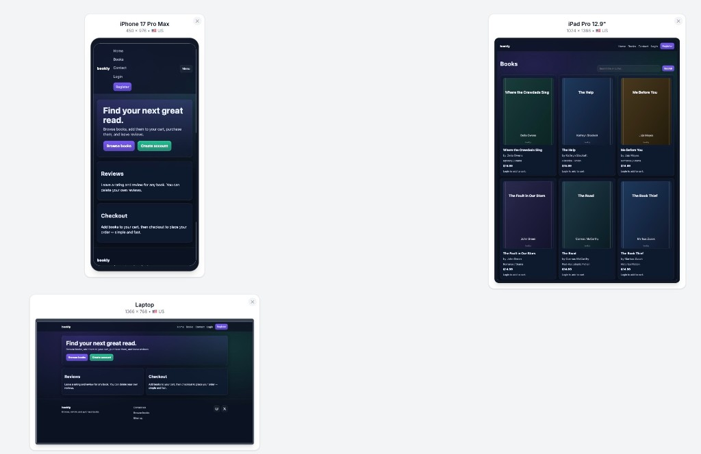
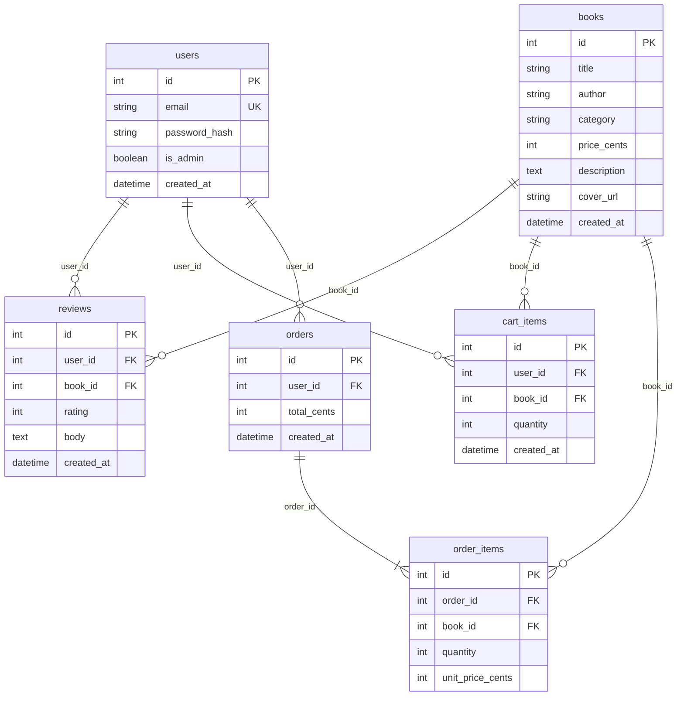

# bookly — bookstore (PostgreSQL + HTML + CSS + JavaScript + Python)

## Table of Contents

- [Overview](#overview)
  - [Project goals](#project-goals)
  - [Planning notes (written at project start)](#planning-notes-written-at-project-start)
- [Quick links](#quick-links)
  - [Marking criteria → README (assessor map)](#marking-criteria--readme-assessor-map)
- [Key UI screenshots](#key-ui-screenshots)
- [Features](#features)
- [User Experience (UX)](#user-experience-ux)
  - [Responsive behaviour](#responsive-behaviour)
  - [How responsiveness was tested](#how-responsiveness-was-tested)
  - [User stories](#user-stories)
- [Wireframes](#wireframes)
- [Design](#design)
  - [Data model and ERD (entity relationships)](#data-model-and-erd-entity-relationships)
- [Technologies Used](#technologies-used)
- [File Structure](#file-structure)
- [Development](#development)
- [Deployment](#deployment)
- [Technical overview](#technical-overview)
  - [Why PostgreSQL is the technical centre of this work](#why-postgresql-is-the-technical-centre-of-this-work)
  - [Request flow overview](#request-flow-overview)
  - [Role of Flask](#role-of-flask)
  - [Project 3 scope vs what this submission demonstrates](#project-3-scope-vs-what-this-submission-demonstrates)
  - [Database (PostgreSQL)](#database-postgresql)
  - [HTML, CSS, JavaScript](#html-css-javascript)
- [Testing and Bugs](#testing-and-bugs)
  - [Assessment test matrix (functionality, usability, responsiveness, data management)](#assessment-test-matrix-functionality-usability-responsiveness-data-management)
  - [Manual Testing](#manual-testing)
  - [Automated Testing](#automated-testing)
  - [Feature to test mapping](#feature-to-test-mapping)
  - [Running pytest locally (terminal evidence)](#running-pytest-locally-terminal-evidence)
  - [Testing summary table](#testing-summary-table)
  - [Bugs encountered during development](#bugs-encountered-during-development)
  - [Use of AI (assistance log)](#use-of-ai-assistance-log)
  - [Lighthouse Testing](#lighthouse-testing)
  - [HTML, CSS and JS Validation](#html-css-and-js-validation)
- [Sources and references](#sources-and-references)
  - [Feature resources (inspiration & references)](#feature-resources-inspiration--references)
  - [Flask](#flask)
  - [PostgreSQL (5 videos)](#postgresql-5-videos)
  - [Python (15 videos / playlists)](#python-15-videos--playlists)
  - [Sources for Python](#sources-for-python)
  - [Images used in this project](#images-used-in-this-project)
  - [Image credits](#image-credits)
- [Attributions](#attributions)
- [Additional Notes](#additional-notes)
- [Author](#author)

---

## Quick links

Assessor-facing links and evidence paths (also useful when marking without searching the whole README):

| Resource | Link or path |
|----------|----------------|
| **Source repository** | `https://github.com/sadek17481748/bookly` — application code and this `README.md` |
| **Live deployment (Heroku)** | `https://bookly-final-98e88d5d388e.herokuapp.com/` |
| **Wireframes (PDF)** | [`docs/wireframe-bookly.pdf`](docs/wireframe-bookly.pdf) |
| **Wireframes (README anchor)** | [Wireframes](#wireframes) |
| **Live app login page** | `/login` on the Heroku URL above |
| **Analytics dashboard (admin-only)** | `/admin/analytics` — KPIs and tables (requires an admin account) |
| **Assessor admin login (example)** | `analytics@testemail.com` / `test123` — see [Development](#development) if the account must be registered on the live database first |
| **Bug tracker (GitHub Project board)** | `https://github.com/users/sadek17481748/projects/6` |
| **GitHub Pages (documentation site)** | `https://sadek17481748.github.io/bookly` |
| **Closed issues (progress log)** | GitHub **Issues** (closed) on the repository |
| **Bug / fix narratives** | [`docs/fix-log.md`](docs/fix-log.md) — short notes per fix next to the manual checklist |
| **Manual test evidence (screenshots)** | [`docs/images/manual-testing/`](docs/images/manual-testing/) — filenames match the [Manual testing](#manual-testing) table |
| **Validation tooling evidence** | [`docs/images/validation/`](docs/images/validation/) — Lighthouse, W3C validators, JSHint, 404, responsiveness composite |

Key screens are also embedded under [Key UI screenshots](#key-ui-screenshots) below.

### Marking criteria → README (assessor map)

These rows tie **this `README.md` only** (no extra marker document) to the parts of the brief that ask for **database design**, **testing across the full stack**, and **a project data model**. The evidence named here is what you should scroll to in the sections linked.

| Criterion (brief wording) | What you should see in this README | Anchor |
|---------------------------|-------------------------------------|--------|
| **Domain database design** — structure relevant to the domain **and relationships between entities** | Relational entities (users, books, reviews, cart, orders), **cardinality table**, and a **Mermaid ERD** showing keys and links between tables. Same design is reflected in `models.py` and `schema.sql`. | [Data model and ERD (entity relationships)](#data-model-and-erd-entity-relationships) |
| **1.5** — test procedures for **functionality**, **usability**, **responsiveness**, and **data management** in the full-stack app | The **four-row assessment matrix** (what was tested, how, where to read it), then the **numbered manual checklist** with Pass/Fail and screenshot paths, plus **automated testing** and the **testing summary** table. | [Assessment test matrix](#assessment-test-matrix-functionality-usability-responsiveness-data-management); [Manual testing](#manual-testing); [Automated testing](#automated-testing); [Testing summary table](#testing-summary-table) |
| **2.1** — **data model** that fits the project purpose | Same subsection as the first row: the ERD and narrative explain how the schema supports browsing, reviews, cart, checkout, and admin reporting. | [Data model and ERD (entity relationships)](#data-model-and-erd-entity-relationships) |

---

## Overview

**bookly** is a web app for browsing books, writing reviews, using a shopping cart, and checking out. Purchases are stored in a **PostgreSQL** database.

The site shows a realistic “small business” workflow:

- Visitors can browse catalog content **read from the database** (not hard-coded pages for each book).
- Registered users can **authenticate** securely (passwords stored as hashes, never plaintext).
- Logged-in users can create and manage **their own** reviews (including **edit** and **delete** with server-side ownership checks).
- Logged-in users can add items to a **cart**, adjust quantities, remove lines, and **check out** so that an **order** and **order line items** are written to Postgres.
- An **admin-only** analytics dashboard reads aggregate data from Postgres (counts, sums, joins) to show revenue, orders, top-selling titles, and category distribution.

### Project goals

- Demonstrate a **relational PostgreSQL** design (users, books, reviews, cart, orders).
- Show clear **end-to-end flows** where DB reads/writes show up in the UI (browse → cart → checkout → orders).
- Implement **auth and permissions** properly (hashed passwords, session login, owner-only review edit/delete, admin-only analytics).
- Keep the project easy to mark by using **server-rendered Flask** and a consistent file structure.

### Planning notes (written at project start)

This is the simple logic and screen plan I would write at the start of building bookly (before coding), to keep the scope clear.

#### Logic flow (simple)

- **Guest visitor**
  - I will let guests browse the catalogue (`/books`) and open book detail pages (`/books/<id>`).
  - When a guest tries to do an account-only action (add to cart, checkout, write a review), I will redirect them to **Login**.

- **Register / login**
  - I will create routes for **Register** (`/register`) and **Login** (`/login`).
  - After login, I will store the session so the site knows who the user is on future requests.

- **Cart**
  - I will store cart items per user in the database so the cart persists (not just in the browser session).
  - Users will be able to add to cart, update quantities, and remove items (`/cart`).

- **Checkout → Orders**
  - I will create a checkout page (`/orders/checkout`) that validates the form, then writes an **Order** and **Order Items** to the database.
  - After checkout, I will clear the user’s cart and show the order in **Orders** (`/orders`).

- **Reviews**
  - Logged-in users will be able to post reviews on a book.
  - Only the owner of a review will be able to edit/delete it (server-side check).

- **Admin analytics**
  - I will add an admin-only dashboard (`/admin/analytics`) to read summary information from the database (counts, totals, top sellers).
  - Non-admin users will see a **403** page when trying to access admin routes.

#### Wireframe plan (what I planned to build)

Based on the routes above, my wireframe plan is:

- **Home (`/`)**: hero + clear calls-to-action (browse books, create account).
- **Books (`/books`)**: searchable grid/list of books (title/author/category/price).
- **Book detail (`/books/<id>`)**: cover + description + add-to-cart + reviews section.
- **Register (`/register`)** and **Login (`/login`)**: card forms with validation messages.
- **Cart (`/cart`)**: list of cart items with update/remove controls and subtotal.
- **Checkout (`/orders/checkout`)**: shipping form + order summary + place order.
- **Orders (`/orders`)**: list of previous orders with totals and line items.
- **Admin analytics (`/admin/analytics`)**: KPIs + tables (recent orders, top books, categories).
- **Admin add book (`/admin/books/new`)**: form to add a new book to the catalogue.
- **Error pages (403/404)**: friendly messages with navigation back to safe pages.

## Key UI screenshots

Screenshots below are stored under `docs/images/manual-testing/` so key screens are visible directly in this README (same files as the manual checklist where applicable).

### Home

### Books

### Contact

### Login

### Register

### Analytics (admin)

---
## Features

### Public browsing

- **Home** page with calls-to-action (browse, register).
- **Book catalog** with optional **search** (`?q=`) over title and author (case-insensitive `ILIKE` in SQLAlchemy → Postgres).
- **Book detail** with description, optional cover image path, cart form (if logged in), and reviews.

### Authentication

- **Register**, **login**, **logout** (Flask-Login).
- Passwords stored with **Werkzeug** hashing (`set_password` / `check_password` on `User`).

### Reviews (CRUD)

- **Create** and **read** reviews on a book; **update** and **delete** only for the **owning** user (checked in `books.py`).
- Reviews are stored with `user_id` and `book_id` foreign keys.

### Cart & checkout

- Add to cart (merge quantity if the same book is already in the cart).
- Update quantity or remove a line.
- **Checkout** collects minimal shipping fields, creates an **order** + **order items**, then **clears the cart** (no external payment gateway—orders are persisted for coursework realism).

### Admin analytics

- **Admin-only** route (`is_admin` on `users`).
- Dashboard metrics from SQL aggregates: revenue, order counts, top sellers, books per category, recent orders.

### Book covers

- Generated **SVG** artwork per seeded title lives under `static/img/covers/`.
- `book_covers.py` maps each title to a stable URL; seeds set `cover_url` so templates can render ``.

---

## User Experience (UX)

### Navigation

- **Sticky** top bar with brand link, **Home**, **Books**, **Contact**.
- When logged in: **Cart**, **Orders**, **Logout**; if `is_admin`: **Analytics**.
- When logged out: **Login**, **Register**.
- **Mobile:** hamburger control toggles link visibility; `aria-expanded` updated in JS for accessibility.

### Interaction design

- **Flash messages** after register, login, cart changes, checkout, errors (categories `success` / `error` styled in CSS).
- **Forms** use labels, placeholders where helpful, and `sr-only` labels for compact controls (e.g. quantity on cart rows).
- **Skip link** to `#main` for keyboard users.
- **Confirm** dialog on destructive actions (e.g. delete review) via `data-confirm` in `main.js`.

### Responsive behaviour

**Why responsiveness matters**

People do not all use the same screen size. Many visitors browse shops on a **phone** while commuting, on a **tablet** at home, or on a **laptop** or **desktop** at a desk. If the layout only worked on one width, text could overflow, buttons could sit too close together, or whole regions might require awkward horizontal scrolling—so tasks like searching the catalogue, editing cart quantities, or filling checkout fields would feel broken or slow. Responsive design keeps the same **functionality** available across form factors, improves **readability** and **touch targets** on small screens, and matches what users expect from a modern web app. For bookly specifically, it matters because the **book grid**, **cart**, **checkout**, and **admin analytics** tables all pack a lot of information; breakpoints and a collapsible nav avoid cramming that into a unusable single wide column on a phone.

**What the CSS does**

- **Best viewed on laptop/desktop:** the catalogue grid, checkout summary, order history, and especially the **admin analytics tables** are easier to read and compare on a wider screen (more items visible at once, less scrolling).
- **Phone/tablet support:** the site was adjusted to be usable on smaller screens (responsive CSS breakpoints stack multi-column layouts into a single column, the book detail page collapses, the footer becomes one column, and the navigation switches to a hamburger menu).

#### How responsiveness was tested

I treated **responsiveness as a manual test pass** (layout and navigation, not something `pytest` asserts on). I exercised the site across **four device classes** so the same core journeys stayed usable at different widths:

| Device class | Typical width / how I simulated it | What I checked |
|--------------|-----------------------------------|----------------|
| **Phone** | Narrow viewport (around **375px** wide, portrait), using Chrome **Device Toolbar** presets and manual resize | Hamburger menu opens/closes; **Home**, **Books**, **Book detail**, **Cart**, and **Checkout** stack in one column; text and prices remain readable without horizontal scroll; quantity fields and buttons are usable. |
| **Tablet** | Medium viewport (around **768px**–**834px**) | Grids move between single- and multi-column behaviour; navigation and footer layouts still balance; book cards and forms do not feel cramped. |
| **Laptop** | Around **1024px**–**1280px** | Catalogue uses the intended multi-column grid; cart and order pages show summaries clearly; flows match “everyday” student/work laptop use. |
| **Desktop** | **1440px** and above (and full-width resize from large down) | Content respects the max-width container (`--max` in CSS) so lines do not stretch uncomfortably wide; **admin analytics** tables and stat tiles use the extra space without breaking alignment. |

**How I ran the pass:** **Google Chrome** with **DevTools → Toggle device toolbar** (responsive mode), switching between built-in device frames and custom widths, and dragging the viewport edge across breakpoints. On each class above I repeated representative flows (**browse → search → book detail → login → cart → checkout** where relevant) and visually confirmed that panels, grids, and the sticky nav behaved as intended. **Landscape** was spot-checked on phone/tablet presets where rotation changes usable height.

#### Responsiveness testing evidence

### User stories

**First-time / guest user**

- As a guest, I want to land on a clear home page so I understand what the site does and what I can do next.
- As a guest, I want to browse the catalogue so I can explore what books are available before making an account.
- As a guest, I want to search by title/author so I can find a specific book quickly.
- As a guest, I want to open a book detail page so I can read the description and existing reviews before deciding whether to register.
- As a guest, I want to see a clear message when I try to access a protected feature (cart, orders, reviews) so I know I need to log in.

**Registered / returning user**

- As a user, I want to register and log in so I can access features that require an account (reviews, cart, checkout, orders).
- As a user, I want to add books to my cart and adjust quantities so I can control my order without starting over.
- As a user, I want the cart total to update correctly when I change quantities so I can trust the checkout amount.
- As a user, I want to check out so my purchase is saved as an order (with order items) in the database.
- As a user, I want to view my order history so I can confirm what I bought after checkout.
- As a user, I want to create reviews with a rating and text so I can share feedback on books I read.
- As a user, I want to edit/delete **my own** reviews so I can correct mistakes or remove outdated feedback.
- As a user, I want to be prevented from editing/deleting other people’s reviews so the site feels fair and secure.

**Admin**

- As an admin, I want to view the analytics dashboard so I can monitor revenue, orders, and top-selling books.
- As an admin, I want to see a category breakdown so I can understand the shape of the catalogue at a glance.
- As an admin, I want to add a new book to the catalogue (including a category and cover) so I can expand inventory without touching the database directly.
- As an admin, I want non-admin users to be blocked from admin pages so sensitive business information is protected.

### Target audience & user stories

The site is aimed at **readers** who want a simple way to browse a small catalogue, check book details, read/write reviews, and place an order using a lightweight checkout flow. It is also aimed at a **store admin** who needs quick visibility of what is happening in the store (revenue, order volume, top sellers, and category distribution) without exporting data or running SQL manually.

In practice, I thought about three “audience groups” while building and testing:

- **Guest visitors**: explore the catalogue and understand the value of the site without being forced to create an account immediately.
- **Registered customers**: complete the core journey (browse → cart → checkout → orders) and manage their own reviews.
- **Admin user**: manage the catalogue (add books) and review store performance using the analytics dashboard.

The user stories above are the ones I used to guide feature scope and testing. They map directly to the live routes and the database flows (catalogue read, review write, cart write, order + order items write, and analytics aggregates).

---

## Wireframes

Low-fidelity wireframes for bookly are in this repository as a single PDF:

- **[`docs/wireframe-bookly.pdf`](docs/wireframe-bookly.pdf)** — planning layouts for the main flows (home, catalogue, book detail, auth, cart/checkout, orders, admin). The screens map to the live routes: **Home** (`/`), **Books** (`/books`), **Book detail** (`/books/<id>`), **Login / Register**, **Cart**, **Checkout**, **Orders**, and **Admin analytics** (`/admin/analytics`).

Any extra Figma links or annotated screenshots I used only in the written report stay in the **coursework appendix**; this PDF is the main wireframe file in the repo.

### Wireframe description (screen-by-screen)

The PDF wireframe is intentionally low fidelity (boxes, labels, and simple components), but it still captures the **layout decisions** and the main **user actions** for each route.

#### Global layout used across screens

- **Header navigation**: logo on the left and the main links on the right (**Home**, **Books**, **Contact**).
- **Auth-aware nav**:
  - When logged out: **Login**, **Register**
  - When logged in: **Cart**, **Orders**, **Logout** (and **Analytics** for admin users)
- **Footer**: quick links (**Contact us**, **Browse books**, **Sitemap**) plus social icons.

#### Home (`/`)

- A hero panel with the primary message (“Discover your next favourite book / Find your next great read”) and two clear calls to action:
  - **Browse books**
  - **Create account**
- Supporting feature cards to preview core functionality (reviews + checkout).

#### Books catalogue (`/books`)

- Page heading (“Our books / Books list”) and a **search bar** (“Search by title or author”).
- A **grid of book cards**, each showing:
  - title, author, category, price
  - an action to **view details** and/or **add to cart** (depending on auth state in the live app).

#### Book detail (`/books/<id>`)

- A split layout with:
  - **Cover image** panel
  - **Book metadata** (title, author, category, price) and a longer description
- A quantity selector and **Add to cart** action (shown for logged-in users in the real UI).
- Reviews section:
  - List of reviews (reviewer email, timestamp, rating, body)
  - Owner controls for edit/delete (represented in the wireframe as buttons alongside reviews).

#### Login (`/login`)

- A compact “card” form with:
  - Email input
  - Password input
  - Login button
  - Link to Register

#### Register (`/register`)

- A matching “card” form with:
  - Email input
  - Password input
  - Confirm password input
  - Register button
  - Link to Login

#### Cart (`/cart`)

- A list/table of cart items with:
  - title, unit price, quantity input
  - **Update** and **Remove** actions per line
- An order summary area showing a subtotal and a clear **Checkout** button.

#### Checkout (`/orders/checkout`)

- A two-column layout:
  - Left: shipping information inputs and a **Place order** button
  - Right: an **order summary** (items, quantities, totals)

#### Orders (`/orders`)

- A list of previous orders (order IDs / timestamps), with the intention that an order can be expanded to show line items and totals.

#### Admin analytics (`/admin/analytics`)

- An admin-only dashboard screen with:
  - KPI summary cards (sales, books, users, new orders)
  - Category breakdown and top sellers
  - Recent orders table
  - A clear admin call-to-action: **Add new book**

#### Admin add book (`/admin/books/new`)

- A form layout for adding to the catalogue, including:
  - title, author, category, price
  - cover image selector
  - description
  - submit button

#### Error pages (403 / 404)

- **404**: a friendly “Page not found” message with buttons to return home or browse books.
- **403**: a clear “Forbidden” message with a back-home action.

---

## Website build process and planning (milestones)

This section summarises **how bookly was built**, in the order features were implemented, and how the scope evolved as I worked through the coursework requirements.

### Foundation completion — **28/03**

I started by building the foundation so every later feature had a stable base:

- **Project setup**: virtual environment, dependencies, and a clean Flask project structure.
- **Configuration**: environment-based settings (`SECRET_KEY`, `DATABASE_URL`) so the same code could run locally and in a hosted environment. (AI)
- **Database first**: a PostgreSQL schema that reflects the core entities and relationships (`users`, `books`, `reviews`, `cart_items`, `orders`, `order_items`) with sensible constraints (foreign keys and uniqueness where needed).
- **Bootstrap commands and seed data**: a repeatable way to initialise the schema and seed a starter catalogue so pages were never “empty by default”. (AI)
- **Shared UI shell**: `base.html` with navigation, flash messages, and consistent layout, plus a first pass of CSS variables and reusable components.

The practical reason for doing this first was personal experience: once the database and layout are stable, every new page becomes “connect the route to the template to the query”, instead of reinventing structure on every screen.(AI)

### Milestone 1 — **31/03** (public pages + shared layout)

This milestone focused on getting the public-facing shell working end-to-end:

- **Home** and **Contact** pages built against the wireframe.
- A consistent navigation experience across pages (logged out experience first).
- Early error pages (especially **403/404**) so the site behaved clearly while routes were still being added.

### Milestone 2 — **05/04** (catalogue)

Once the shell was working, I moved onto the first database-driven feature:

- **Books list** (`/books`) populated from the database rather than static HTML.
- **Book detail** (`/books/<id>`) with price, description, and cover rendering.
- A simple **search** experience (`?q=`) to demonstrate database filtering.
- Catalogue seeding and cover URLs so the UI looked complete and consistent.

### Milestone 3 — **10/04** (authentication)

At this point scope shifted from “pages” to “user actions”:

- **Register / login / logout** implemented with hashed passwords and session management.
- Navigation updated based on authentication state (cart/orders only appear when logged in).
- Protected routes added so guest users are redirected away from actions that require an account.

### Milestone 4 — **13/04** (reviews)

Reviews were the first feature that required a mix of database relationships and security checks:

- Logged-in users can **create** reviews linked by foreign keys to both the user and the book.
- Reviews display on the book detail page.
- **Edit and delete** are restricted to the review owner with server-side checks (not only template logic).

### Milestone 5 — **16/04** (cart)

The cart is implemented as a database feature (not a session-only cart), which made scope and data modelling more important:

- Add-to-cart writes to `cart_items` and merges quantity using a uniqueness rule for one row per (user, book).
- The cart page supports quantity updates and removals with totals calculated from book prices.
- Edge cases handled (empty cart, invalid quantities) so the checkout flow would not be fragile later.

### Milestone 6 — **20/04** (checkout + orders)

This milestone turned “basket data” into “transaction history”:

- Checkout form added (minimal shipping/contact fields for coursework realism).
- Submitting checkout creates an `orders` row and multiple `order_items` rows, then clears the cart for that user.
- Orders history added so users can view what they purchased after checkout.

### Milestone 7 — **25/04** (admin analytics + final integration)

Admin analytics was the last major feature because it depends on the rest of the data model being correct:

- Admin-only route protection with a clear **403** for non-admin users.
- Dashboard queries based on aggregates and joins (revenue, order counts, top books, categories).
- A final integration pass to make flows consistent (navigation, flash messaging, and layout across templates).

### Testing and final foundation pass — **25/04**

Testing was completed alongside feature work, but the final day was a dedicated pass to make sure everything was coherent:

- **Automated testing**: pytest suite for key routes and behaviours using a fast in-memory database for repeatable runs.
- **Manual testing**: end-to-end walkthroughs on PostgreSQL (browse → auth → review → cart → checkout → orders), plus admin access checks.
- **Scope reflection**: the largest scope risks were multi-table writes (checkout) and role/ownership enforcement (reviews + admin). Those were the areas I revisited most during the final testing pass because they are easiest to “seem fine” until you try edge cases.

### Personal reflection (time constraints and improved time/communication plan)

From personal experience, project time constraints can change quickly. During this project I was **heavily delayed by personal issues**, which reduced the amount of uninterrupted time I had for development and testing. Even though the core features were completed, the delay meant I had to compress work into fewer sessions, which increases the risk of mistakes and makes progress harder to track.

In future projects, to manage my time and communication better, I would take the following steps.

#### What I would do differently next time

- **Start with a realistic schedule and visible checkpoints**
  - Break the project into small deliverables (foundation, catalogue, auth, reviews, cart, checkout, admin, testing).
  - Set short checkpoints (every 2–3 days) so progress is measurable even when time is limited.
- **Timebox work sessions and protect “core hours”**
  - Plan focused sessions (for example 60–90 minutes) with a single goal (one route, one feature, or one bug).
  - Reserve dedicated time for testing and bug fixing rather than leaving it to the end.
- **Prioritise core functionality first (MVP first)**
  - Build the “must-have” user journey early: browse → login → cart → checkout → orders.
  - Treat admin analytics and extra polish as optional until the main flow is stable.
- **Track decisions and changes as I go**
  - Keep short notes after each session (what was done, what broke, what is next).
  - Record database changes and why they were made so I do not lose time re-learning decisions later.
- **Communicate earlier when delays happen**
  - If I hit a personal issue or a schedule slip, I would communicate it earlier rather than trying to recover silently.
  - Share a revised plan (what will be completed first, and what may be reduced) so expectations stay clear.
- **Reduce risk by testing continuously**
  - Run automated tests regularly (not only at the end).
  - Do quick manual checks after each major feature (especially multi-table writes like checkout and role/ownership rules).

#### What I learned

This project reinforced that the biggest risk under time pressure is not writing code—it is losing structure: forgetting what changed, delaying testing, and trying to complete too many features at once. A clearer schedule, earlier communication, and smaller planned deliverables would make future projects more controlled and less stressful, even if delays happen.

#### Planned but not completed (time constraint)

Late in development, I planned a small admin improvement: a **“Complete order”** button on the admin side (so an admin could mark an order as completed after checkout). The idea came from watching extra e-commerce tutorials and thinking about how a real store would track order status, but I did not have enough time to implement it properly before submission.

In a future iteration, I would add an `order_status` field (for example: Pending → Completed), show it on the admin dashboard, and only allow status changes for admin users with server-side validation. (AI)

---

## Design

### Data model and ERD (entity relationships)

This subsection documents the **relational data model** for bookly: entities, attributes, and how records link across tables. It covers **database structure for the domain** (users, catalogue, social reviews, cart, orders) and **relationships between entities**.

The implementation lives in `models.py` and `schema.sql` (DDL reference). Money is stored as **integer cents** (`price_cents`, `total_cents`, `unit_price_cents`) to avoid floating-point errors. **Order line items** snapshot `unit_price_cents` at checkout so historical orders stay correct if a book’s price changes later.

**Cardinality (summary)**

| From | Relationship | To | Notes |
|------|--------------|-----|-------|
| `users` | 1 → many | `reviews` | `ON DELETE CASCADE` from user |
| `books` | 1 → many | `reviews` | `ON DELETE CASCADE` from book |
| `users` | 1 → many | `cart_items` | Unique `(user_id, book_id)` merges duplicate adds |
| `books` | 1 → many | `cart_items` | One quantity per user–book pair |
| `users` | 1 → many | `orders` | `ON DELETE RESTRICT` on user (protects order history) |
| `orders` | 1 → many | `order_items` | `ON DELETE CASCADE` from order |
| `books` | 1 → many | `order_items` | `ON DELETE RESTRICT` (catalogue integrity) |

**ERD (Entity Relationship Diagram)**

The diagram below is a logical view of the same schema PostgreSQL applies via foreign keys and constraints.

```mermaid
erDiagram
    users ||--o{ reviews : "user_id"
    users ||--o{ cart_items : "user_id"
    users ||--o{ orders : "user_id"
    books ||--o{ reviews : "book_id"
    books ||--o{ cart_items : "book_id"
    books ||--o{ order_items : "book_id"
    orders ||--|{ order_items : "order_id"

    users {
        int id PK
        string email UK
        string password_hash
        boolean is_admin
        datetime created_at
    }

    books {
        int id PK
        string title
        string author
        string category
        int price_cents
        text description
        string cover_url
        datetime created_at
    }

    reviews {
        int id PK
        int user_id FK
        int book_id FK
        int rating
        text body
        datetime created_at
    }

    cart_items {
        int id PK
        int user_id FK
        int book_id FK
        int quantity
        datetime created_at
    }

    orders {
        int id PK
        int user_id FK
        int total_cents
        datetime created_at
    }

    order_items {
        int id PK
        int order_id FK
        int book_id FK
        int quantity
        int unit_price_cents
    }
```

### Visual language

- **Dark theme** with CSS variables (`--bg`, `--panel`, `--text`, `--brand`, `--danger`, etc.) in `static/css/styles.css` for consistent colour and spacing.
- **Gradients** on hero and buttons for depth; **cards** with subtle borders and shadows for content grouping.
- **Typography:** system UI stack (`ui-sans-serif`, `system-ui`, …) for fast loading and native feel.

### Colour scheme (and why)

The site uses a **dark, high-contrast** palette to keep long reading sessions comfortable and to make book covers and cards stand out clearly.

- **Background (`--bg`)**: deep navy used as the base canvas so content panels feel separated without heavy borders.
- **Panels (`--panel`)**: slightly lighter navy for cards and sections to create depth while staying consistent with the dark theme.
- **Text (`--text`) + muted text (`--muted`)**: bright off-white for readability, with a muted variant for secondary information (author names, timestamps, hints).
- **Primary brand (`--brand`)**: purple accent for primary actions and key highlights (buttons, links) to give the UI a recognisable identity.
- **Secondary accent (`--brand2`)**: green accent used sparingly to add contrast in gradients and to avoid a single-colour interface.
- **Danger (`--danger`)**: pink/red accent reserved for destructive actions (delete/remove) so risk actions are visually obvious.

These choices are implemented as CSS variables at the top of `static/css/styles.css` so the palette is consistent across the whole site and easy to adjust in one place.

### Layout

- **Max content width** (`--max`) with horizontal padding so lines do not stretch too wide on large monitors.
- **CSS Grid** for book grids (two/three columns, collapsing on small viewports).
- **Admin dashboard:** stat tiles + scrollable table for “top books”.

### Imagery

- **Covers:** SVG files under `static/img/covers/` (title + author on gradient) to avoid copyright issues with publisher jacket scans while still filling the layout.

### Accessibility choices

- Skip link, `aria-live` on flash stack, `aria-label` / `aria-expanded` where applicable, visible focus on skip link.

---

## Technologies Used

### Languages

- **Python** — application logic, ORM, routing.
- **HTML** — structure via Jinja2 templates.
- **CSS** — layout and theme.
- **JavaScript** — small client behaviours only.

### Frameworks & libraries

| Piece | Role |
|-------|------|
| **Flask** | Web framework, routing, templates |
| **Flask-Login** | Session-based authentication |
| **Flask-SQLAlchemy** | ORM + session management to PostgreSQL |
| **psycopg2** (binary) | PostgreSQL driver in `DATABASE_URL` |
| **python-dotenv** | Load `.env` locally |
| **gunicorn** | Production WSGI server (Heroku `Procfile`) |
| **pytest** | Automated tests (`tests/`) |

**Frontend libraries note:** No UI framework such as **Bootstrap** was used. The UI is custom CSS in `static/css/styles.css` and a small amount of vanilla JavaScript in `static/js/main.js` (no jQuery).

### Tools

| Tool | Used for |
|------|----------|
| **Git** | Version control |
| **PostgreSQL / psql** | Local database, ad-hoc SQL checks |
| **VS Code** | Editing and integrated terminal |
| **Heroku CLI** | Deploy, logs, `heroku run` for `init-db` |
| **Chrome DevTools** | Network tab, responsive mode, Lighthouse |

---

