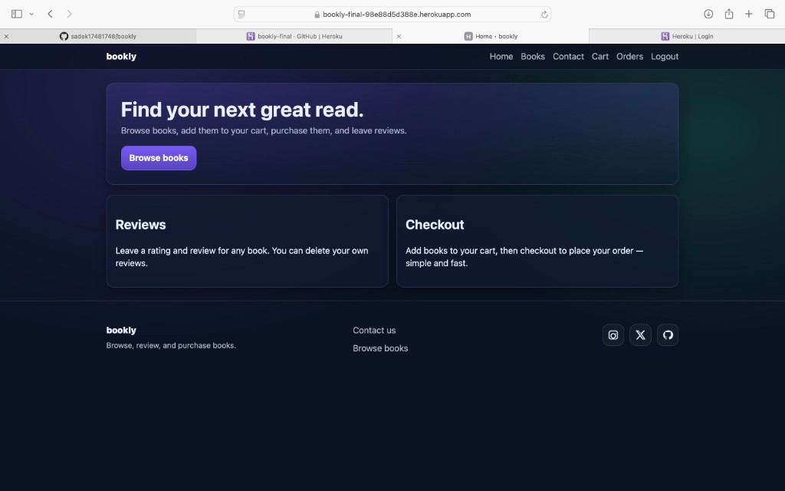
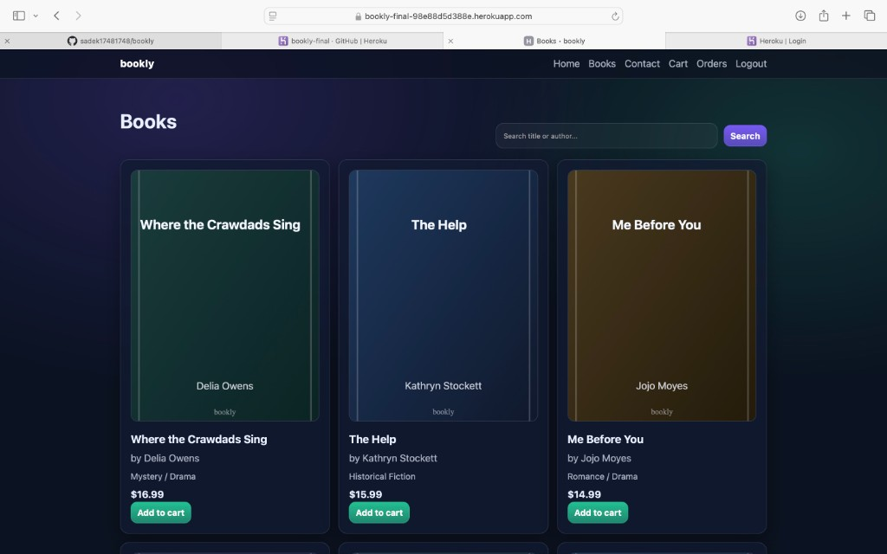
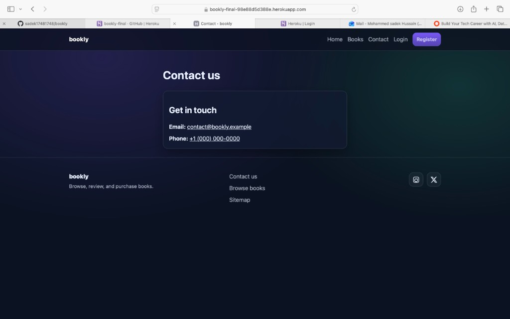
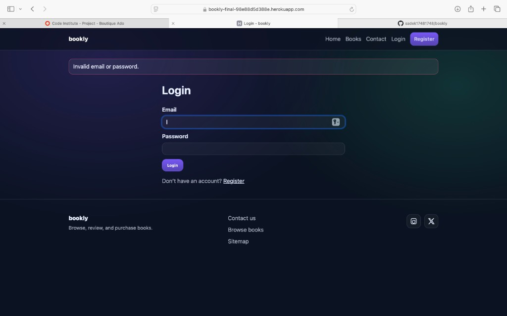
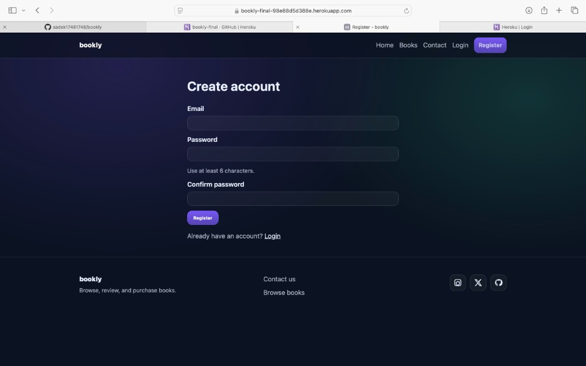
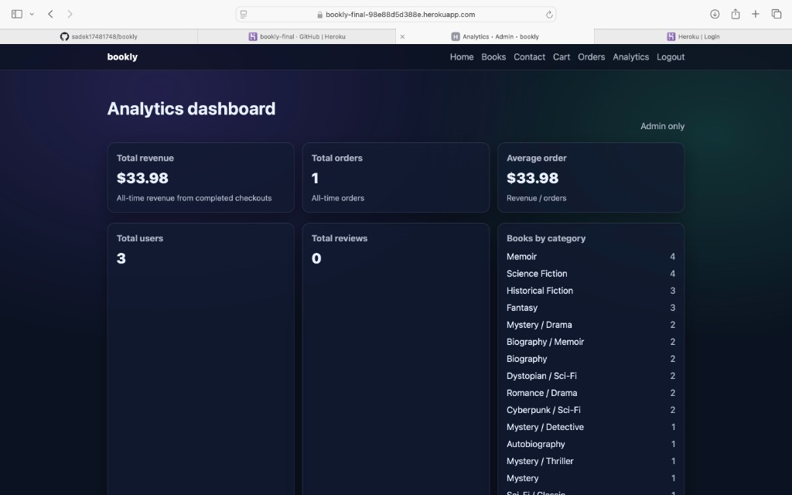

# bookly — bookstore (PostgreSQL + HTML + CSS + JavaScript + Python)

## Table of Contents

- [Overview](#overview)
  - [Project goals](#project-goals)
  - [Planning notes (written at project start)](#planning-notes-written-at-project-start)
- [Quick links](#quick-links)
  - [Marking criteria → README (assessor map)](#marking-criteria--readme-assessor-map)
- [Key UI screenshots](#key-ui-screenshots)
- [Features](#features)
- [User Experience (UX)](#user-experience-ux)
  - [Responsive behaviour](#responsive-behaviour)
  - [How responsiveness was tested](#how-responsiveness-was-tested)
  - [User stories](#user-stories)
- [Wireframes](#wireframes)
- [Design](#design)
  - [Data model and ERD (entity relationships)](#data-model-and-erd-entity-relationships)
- [Technologies Used](#technologies-used)
- [File Structure](#file-structure)
- [Development](#development)
- [Deployment](#deployment)
- [Technical overview](#technical-overview)
  - [Why PostgreSQL is the technical centre of this work](#why-postgresql-is-the-technical-centre-of-this-work)
  - [Request flow overview](#request-flow-overview)
  - [Role of Flask](#role-of-flask)
  - [Project 3 scope vs what this submission demonstrates](#project-3-scope-vs-what-this-submission-demonstrates)
  - [Database (PostgreSQL)](#database-postgresql)
  - [HTML, CSS, JavaScript](#html-css-javascript)
- [Testing and Bugs](#testing-and-bugs)
  - [Assessment test matrix (functionality, usability, responsiveness, data management)](#assessment-test-matrix-functionality-usability-responsiveness-data-management)
  - [Manual Testing](#manual-testing)
  - [Automated Testing](#automated-testing)
  - [Feature to test mapping](#feature-to-test-mapping)
  - [Running pytest locally (terminal evidence)](#running-pytest-locally-terminal-evidence)
  - [Testing summary table](#testing-summary-table)
  - [Bugs encountered during development](#bugs-encountered-during-development)
  - [Use of AI (assistance log)](#use-of-ai-assistance-log)
  - [Lighthouse Testing](#lighthouse-testing)
  - [HTML, CSS and JS Validation](#html-css-and-js-validation)
- [Sources and references](#sources-and-references)
  - [Feature resources (inspiration & references)](#feature-resources-inspiration--references)
  - [Flask](#flask)
  - [PostgreSQL (5 videos)](#postgresql-5-videos)
  - [Python (15 videos / playlists)](#python-15-videos--playlists)
  - [Sources for Python](#sources-for-python)
  - [Images used in this project](#images-used-in-this-project)
  - [Image credits](#image-credits)
- [Attributions](#attributions)
- [Additional Notes](#additional-notes)
- [Author](#author)

---

## Quick links

Assessor-facing links and evidence paths (also useful when marking without searching the whole README):

| Resource | Link or path |
|----------|----------------|
| **Source repository** | `https://github.com/sadek17481748/bookly` — application code and this `README.md` |
| **Live deployment (Heroku)** | `https://bookly-final-98e88d5d388e.herokuapp.com/` |
| **Wireframes (PDF)** | [`docs/wireframe-bookly.pdf`](docs/wireframe-bookly.pdf) |
| **Wireframes (README anchor)** | [Wireframes](#wireframes) |
| **Live app login page** | `/login` on the Heroku URL above |
| **Analytics dashboard (admin-only)** | `/admin/analytics` — KPIs and tables (requires an admin account) |
| **Assessor admin login (example)** | `analytics@testemail.com` / `test123` — see [Development](#development) if the account must be registered on the live database first |
| **Bug tracker (GitHub Project board)** | `https://github.com/users/sadek17481748/projects/6` |
| **GitHub Pages (documentation site)** | `https://sadek17481748.github.io/bookly` |
| **Closed issues (progress log)** | GitHub **Issues** (closed) on the repository |
| **Bug / fix narratives** | [`docs/fix-log.md`](docs/fix-log.md) — short notes per fix next to the manual checklist |
| **Manual test evidence (screenshots)** | [`docs/images/manual-testing/`](docs/images/manual-testing/) — filenames match the [Manual testing](#manual-testing) table |
| **Validation tooling evidence** | [`docs/images/validation/`](docs/images/validation/) — Lighthouse, W3C validators, JSHint, 404, responsiveness composite |

Key screens are also embedded under [Key UI screenshots](#key-ui-screenshots) below.

### Marking criteria → README (assessor map)

These rows tie **this `README.md` only** (no extra marker document) to the parts of the brief that ask for **database design**, **testing across the full stack**, and **a project data model**. The evidence named here is what you should scroll to in the sections linked.

| Criterion (brief wording) | What you should see in this README | Anchor |
|---------------------------|-------------------------------------|--------|
| **Domain database design** — structure relevant to the domain **and relationships between entities** | Relational entities (users, books, reviews, cart, orders), **cardinality table**, and a **Mermaid ERD** showing keys and links between tables. Same design is reflected in `models.py` and `schema.sql`. | [Data model and ERD (entity relationships)](#data-model-and-erd-entity-relationships) |
| **1.5** — test procedures for **functionality**, **usability**, **responsiveness**, and **data management** in the full-stack app | The **four-row assessment matrix** (what was tested, how, where to read it), then the **numbered manual checklist** with Pass/Fail and screenshot paths, plus **automated testing** and the **testing summary** table. | [Assessment test matrix](#assessment-test-matrix-functionality-usability-responsiveness-data-management); [Manual testing](#manual-testing); [Automated testing](#automated-testing); [Testing summary table](#testing-summary-table) |
| **2.1** — **data model** that fits the project purpose | Same subsection as the first row: the ERD and narrative explain how the schema supports browsing, reviews, cart, checkout, and admin reporting. | [Data model and ERD (entity relationships)](#data-model-and-erd-entity-relationships) |

---

## Overview

**bookly** is a web app for browsing books, writing reviews, using a shopping cart, and checking out. Purchases are stored in a **PostgreSQL** database.

The site shows a realistic “small business” workflow:

- Visitors can browse catalog content **read from the database** (not hard-coded pages for each book).
- Registered users can **authenticate** securely (passwords stored as hashes, never plaintext).
- Logged-in users can create and manage **their own** reviews (including **edit** and **delete** with server-side ownership checks).
- Logged-in users can add items to a **cart**, adjust quantities, remove lines, and **check out** so that an **order** and **order line items** are written to Postgres.
- An **admin-only** analytics dashboard reads aggregate data from Postgres (counts, sums, joins) to show revenue, orders, top-selling titles, and category distribution.

### Project goals

- Demonstrate a **relational PostgreSQL** design (users, books, reviews, cart, orders).
- Show clear **end-to-end flows** where DB reads/writes show up in the UI (browse → cart → checkout → orders).
- Implement **auth and permissions** properly (hashed passwords, session login, owner-only review edit/delete, admin-only analytics).
- Keep the project easy to mark by using **server-rendered Flask** and a consistent file structure.

### Planning notes (written at project start)

This is the simple logic and screen plan I would write at the start of building bookly (before coding), to keep the scope clear.

#### Logic flow (simple)

- **Guest visitor**
  - I will let guests browse the catalogue (`/books`) and open book detail pages (`/books/<id>`).
  - When a guest tries to do an account-only action (add to cart, checkout, write a review), I will redirect them to **Login**.

- **Register / login**
  - I will create routes for **Register** (`/register`) and **Login** (`/login`).
  - After login, I will store the session so the site knows who the user is on future requests.

- **Cart**
  - I will store cart items per user in the database so the cart persists (not just in the browser session).
  - Users will be able to add to cart, update quantities, and remove items (`/cart`).

- **Checkout → Orders**
  - I will create a checkout page (`/orders/checkout`) that validates the form, then writes an **Order** and **Order Items** to the database.
  - After checkout, I will clear the user’s cart and show the order in **Orders** (`/orders`).

- **Reviews**
  - Logged-in users will be able to post reviews on a book.
  - Only the owner of a review will be able to edit/delete it (server-side check).

- **Admin analytics**
  - I will add an admin-only dashboard (`/admin/analytics`) to read summary information from the database (counts, totals, top sellers).
  - Non-admin users will see a **403** page when trying to access admin routes.

#### Wireframe plan (what I planned to build)

Based on the routes above, my wireframe plan is:

- **Home (`/`)**: hero + clear calls-to-action (browse books, create account).
- **Books (`/books`)**: searchable grid/list of books (title/author/category/price).
- **Book detail (`/books/<id>`)**: cover + description + add-to-cart + reviews section.
- **Register (`/register`)** and **Login (`/login`)**: card forms with validation messages.
- **Cart (`/cart`)**: list of cart items with update/remove controls and subtotal.
- **Checkout (`/orders/checkout`)**: shipping form + order summary + place order.
- **Orders (`/orders`)**: list of previous orders with totals and line items.
- **Admin analytics (`/admin/analytics`)**: KPIs + tables (recent orders, top books, categories).
- **Admin add book (`/admin/books/new`)**: form to add a new book to the catalogue.
- **Error pages (403/404)**: friendly messages with navigation back to safe pages.

## Key UI screenshots

Screenshots below are stored under `docs/images/manual-testing/` so key screens are visible directly in this README (same files as the manual checklist where applicable).

### Home

### Books

### Contact

### Login

### Register

### Analytics (admin)

---
## Features

### Public browsing

- **Home** page with calls-to-action (browse, register).
- **Book catalog** with optional **search** (`?q=`) over title and author (case-insensitive `ILIKE` in SQLAlchemy → Postgres).
- **Book detail** with description, optional cover image path, cart form (if logged in), and reviews.

### Authentication

- **Register**, **login**, **logout** (Flask-Login).
- Passwords stored with **Werkzeug** hashing (`set_password` / `check_password` on `User`).

### Reviews (CRUD)

- **Create** and **read** reviews on a book; **update** and **delete** only for the **owning** user (checked in `books.py`).
- Reviews are stored with `user_id` and `book_id` foreign keys.

### Cart & checkout

- Add to cart (merge quantity if the same book is already in the cart).
- Update quantity or remove a line.
- **Checkout** collects minimal shipping fields, creates an **order** + **order items**, then **clears the cart** (no external payment gateway—orders are persisted for coursework realism).

### Admin analytics

- **Admin-only** route (`is_admin` on `users`).
- Dashboard metrics from SQL aggregates: revenue, order counts, top sellers, books per category, recent orders.

### Book covers

- Generated **SVG** artwork per seeded title lives under `static/img/covers/`.
- `book_covers.py` maps each title to a stable URL; seeds set `cover_url` so templates can render ``.

---

